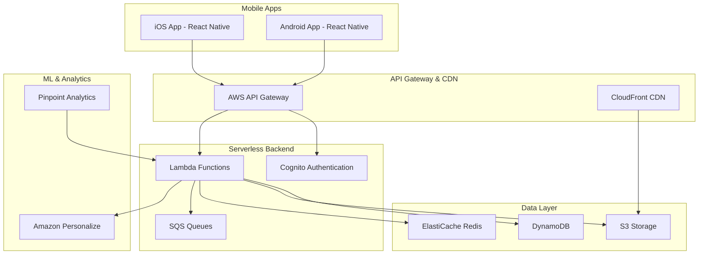

# Design Document

## Overview

The Quranic Vocabulary Learning App is a cross-platform mobile application built with React Native for iOS and Android, backed by a serverless AWS infrastructure. The system employs adaptive learning algorithms, spaced repetition techniques, and multi-modal content delivery to optimize vocabulary acquisition. The architecture prioritizes cost efficiency through serverless computing, intelligent caching, and usage-based scaling.

## Architecture

### High-Level Architecture



### Technology Stack

**Frontend:**
- React Native with TypeScript for cross-platform development
- Redux Toolkit for state management
- React Native Async Storage for offline data
- React Native Push Notifications for reminders

**Backend:**
- AWS Lambda (Node.js/TypeScript) for serverless compute
- AWS API Gateway for REST API endpoints
- AWS Cognito for authentication and user management
- Amazon DynamoDB for user data and progress tracking
- Amazon S3 for media content (audio, images)
- Amazon CloudFront for global content delivery
- Amazon ElastiCache (Redis) for session and content caching

**Machine Learning:**
- Amazon Personalize for adaptive learning recommendations
- Custom spaced repetition algorithms in Lambda functions
- Amazon Comprehend for text analysis (if needed)

## Components and Interfaces

### Mobile Application Components

#### 1. Authentication Module
- **Purpose:** Handle user registration, login, and session management
- **Interface:** Integrates with AWS Cognito
- **Key Features:** Social login, guest mode, secure token storage

#### 2. Learning Engine
- **Purpose:** Core vocabulary learning interface with multi-modal content
- **Components:**
  - Visual Learning Component (images, calligraphy, root diagrams)
  - Audio Learning Component (pronunciation, recitation)
  - Contextual Learning Component (verses, translations)
  - Association Learning Component (related words, derivatives)
- **Interface:** Consumes content from Content API and tracks interactions

#### 3. Spaced Repetition Manager
- **Purpose:** Schedule and manage review sessions
- **Algorithm:** Modified SM-2 algorithm with personalization factors
- **Interface:** Communicates with Progress Tracking API

#### 4. Conjugation Trainer
- **Purpose:** Interactive verb conjugation learning and practice
- **Components:**
  - Conjugation Display (all forms, tenses)
  - Interactive Exercises (form identification, fill-in-the-blank)
  - Grammar Analysis (root identification, pattern recognition)
- **Interface:** Integrates with Learning Engine for seamless experience

#### 5. Progress Dashboard
- **Purpose:** Visualize learning journey and achievements
- **Components:**
  - Statistics Display (mastery levels, streaks)
  - Achievement System (badges, milestones)
  - Analytics Charts (progress trends, time invested)
- **Interface:** Consumes data from Analytics API

#### 6. Offline Manager
- **Purpose:** Enable core functionality without internet connection
- **Features:** Local content caching, progress queue, sync on reconnection
- **Storage:** React Native Async Storage with SQLite for complex queries

### Backend API Components

#### 1. User Management Service
- **Endpoints:**
  - `POST /auth/register` - User registration
  - `POST /auth/login` - User authentication
  - `GET /user/profile` - User profile data
  - `PUT /user/preferences` - Update learning preferences
- **Database:** DynamoDB table for user profiles and preferences

#### 2. Content Management Service
- **Endpoints:**
  - `GET /content/words` - Retrieve vocabulary words with metadata
  - `GET /content/media/{wordId}` - Get media content (audio, images)
  - `GET /content/verses/{wordId}` - Get contextual verses
  - `GET /content/conjugations/{verbId}` - Get verb conjugation data
- **Storage:** S3 for media files, DynamoDB for metadata
- **Caching:** Redis for frequently accessed content

#### 3. Learning Progress Service
- **Endpoints:**
  - `POST /progress/session` - Record learning session
  - `GET /progress/stats` - Retrieve user statistics
  - `PUT /progress/word/{wordId}` - Update word mastery level
  - `GET /progress/review-queue` - Get words due for review
- **Database:** DynamoDB with GSI for efficient querying
- **Processing:** SQS for asynchronous progress calculations

#### 4. Adaptive Learning Service
- **Endpoints:**
  - `GET /recommendations/next-words` - Get personalized word recommendations
  - `POST /recommendations/feedback` - Record learning effectiveness feedback
  - `GET /recommendations/study-plan` - Generate adaptive study plan
- **ML Integration:** Amazon Personalize for recommendation engine
- **Algorithm:** Custom spaced repetition with personalization factors

#### 5. Notification Service
- **Endpoints:**
  - `POST /notifications/schedule` - Schedule review reminders
  - `PUT /notifications/preferences` - Update notification settings
  - `POST /notifications/send` - Send immediate notifications
- **Integration:** Amazon Pinpoint for push notifications
- **Scheduling:** CloudWatch Events for automated reminders

## Data Models

### User Profile
```typescript
interface UserProfile {
  userId: string;
  email: string;
  displayName: string;
  createdAt: Date;
  lastActiveAt: Date;
  preferences: {
    learningModalities: string[];
    notificationFrequency: 'low' | 'medium' | 'high';
    studyGoal: number; // words per day
    preferredStudyTime: string;
  };
  statistics: {
    totalWordsLearned: number;
    currentStreak: number;
    longestStreak: number;
    totalStudyTime: number;
  };
}
```

### Vocabulary Word
```typescript
interface VocabularyWord {
  wordId: string;
  arabicText: string;
  transliteration: string;
  translation: string;
  rootLetters: string;
  wordType: 'noun' | 'verb' | 'particle' | 'adjective';
  frequency: number; // occurrence frequency in Quran
  difficulty: 'beginner' | 'intermediate' | 'advanced';
  mediaContent: {
    audioUrl: string;
    imageUrls: string[];
    calligraphyUrl: string;
  };
  contextualExamples: ContextualExample[];
  relatedWords: string[]; // wordIds of related words
}
```

### Learning Progress
```typescript
interface WordProgress {
  userId: string;
  wordId: string;
  masteryLevel: number; // 0-100
  reviewCount: number;
  correctAnswers: number;
  lastReviewed: Date;
  nextReviewDate: Date;
  learningModality: string[];
  difficultyAdjustments: number;
  averageResponseTime: number;
}
```

### Conjugation Data
```typescript
interface VerbConjugation {
  verbId: string;
  rootForm: string;
  conjugations: {
    [tense: string]: {
      [person: string]: {
        [number: string]: {
          [gender: string]: string;
        };
      };
    };
  };
  patterns: string[];
  irregularities: string[];
}
```

## Error Handling

### Client-Side Error Handling
- **Network Errors:** Graceful degradation to offline mode with user notification
- **Authentication Errors:** Automatic token refresh with fallback to re-authentication
- **Content Loading Errors:** Retry mechanism with exponential backoff
- **Validation Errors:** Real-time form validation with clear error messages

### Server-Side Error Handling
- **Lambda Function Errors:** Structured error responses with appropriate HTTP status codes
- **Database Errors:** Retry logic with circuit breaker pattern
- **External Service Errors:** Fallback mechanisms and graceful degradation
- **Rate Limiting:** Implement throttling with user-friendly error messages

### Monitoring and Alerting
- **CloudWatch Logs:** Centralized logging for all Lambda functions
- **CloudWatch Alarms:** Automated alerts for error rates and performance metrics
- **X-Ray Tracing:** Distributed tracing for performance optimization
- **Custom Metrics:** Business-specific metrics for learning effectiveness

## Testing Strategy

### Unit Testing
- **Frontend:** Jest and React Native Testing Library for component testing
- **Backend:** Jest for Lambda function unit tests with mocked AWS services
- **Coverage Target:** Minimum 80% code coverage for critical paths

### Integration Testing
- **API Testing:** Automated tests for all API endpoints using Postman/Newman
- **Database Testing:** Test data consistency and query performance
- **Authentication Flow:** End-to-end authentication and authorization testing

### Performance Testing
- **Load Testing:** Simulate concurrent users using Artillery or similar tools
- **Mobile Performance:** Test app performance on various device configurations
- **Backend Scalability:** Test Lambda cold starts and DynamoDB throughput

### User Acceptance Testing
- **Learning Effectiveness:** A/B testing for different learning modalities
- **User Experience:** Usability testing with target user groups
- **Accessibility:** Ensure compliance with mobile accessibility standards

### Cost Optimization Testing
- **Resource Usage:** Monitor and optimize Lambda execution time and memory
- **Database Efficiency:** Optimize DynamoDB queries and indexing strategies
- **Content Delivery:** Test CDN effectiveness and S3 storage optimization

## Security Considerations

### Authentication and Authorization
- **Multi-Factor Authentication:** Optional MFA for enhanced security
- **JWT Token Management:** Secure token storage and automatic refresh
- **Role-Based Access:** Different access levels for users and administrators

### Data Protection
- **Encryption:** Data encryption at rest (DynamoDB, S3) and in transit (HTTPS/TLS)
- **Privacy Compliance:** GDPR and CCPA compliance for user data handling
- **Data Minimization:** Collect only necessary user data for functionality

### API Security
- **Rate Limiting:** Prevent abuse with API Gateway throttling
- **Input Validation:** Comprehensive validation for all API inputs
- **CORS Configuration:** Proper cross-origin resource sharing setup

## Deployment and Infrastructure

### CI/CD Pipeline
- **Source Control:** Git-based workflow with feature branches
- **Build Process:** Automated builds for both mobile apps and backend services
- **Testing Integration:** Automated testing in CI/CD pipeline
- **Deployment Stages:** Development, staging, and production environments

### Infrastructure as Code
- **AWS CDK:** Define infrastructure using TypeScript
- **Environment Management:** Separate stacks for different environments
- **Resource Tagging:** Consistent tagging for cost tracking and management

### Monitoring and Maintenance
- **Health Checks:** Automated health monitoring for all services
- **Performance Monitoring:** Real-time performance metrics and alerting
- **Cost Monitoring:** Automated cost tracking and budget alerts
- **Backup Strategy:** Automated backups for critical data with retention policies